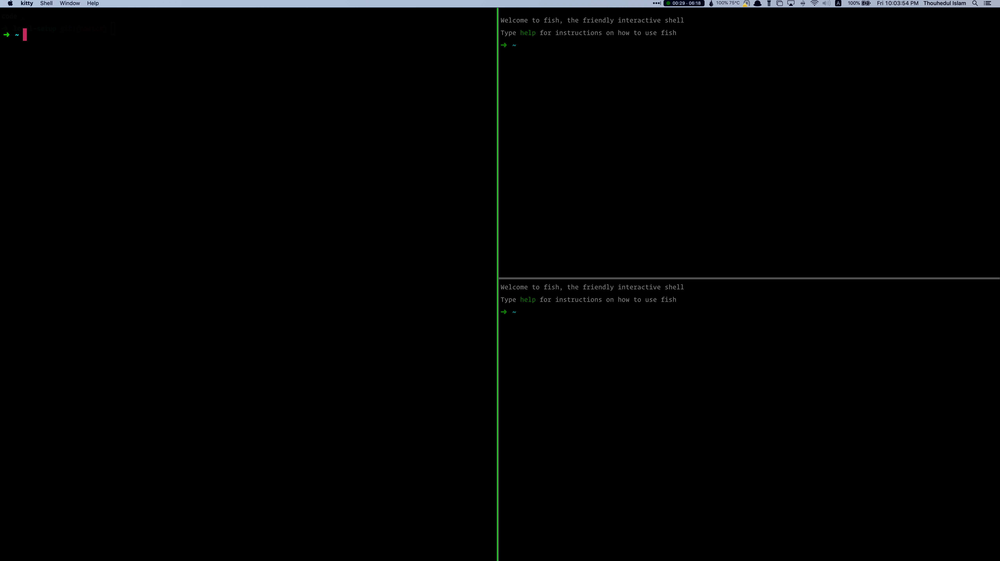

# Local Setup
Here is the list of local setup, software, and tools that I use in every single day for coding. I use Mac OS in office and home environment.

# Tools
Tools that I use for speed up my development.

## Terminals
I use two terminals simultaneously. Primarily I use [Kitty Terminal](https://sw.kovidgoyal.net/kitty/) beside [iTerm](https://iterm2.com/)

### Kitty Terminal
Settings is always depends on personal preference, however here is my preference settings for kitty.

[~/kitty-cat/kitty.conf](tools/terminals/kitty/kitty.conf)

A kitty screenshot-


### iTerms

# Code Editor
My primary code editor is [Visual Studio Code](https://code.visualstudio.com/) editor.

## VS Code
I use VS Code in every single day.

- **Theme** Github
- **Color** White
- **Font** Operator Mono
- **Font Size** 16
- **Line Height** 32

[Find full settings.json](code-editors/vs-code/settings.json)

### VIM
I am a big fan of [VIM](https://www.vim.org/). I am using vim in VS Code. Beside regular commands of VIM, I use some customized command. Here is a sample-

```json
    /**
    * VIM Settings
    **/
    "vim.insertModeKeyBindings": [
        {
            "before": ["j", "j"],
            "after": ["<Esc>"]
        },
    ],
    "vim.normalModeKeyBindings": [
        {
            "before": ["<tab>"],
            "commands": ["workbench.action.nextEditor"],
        },
        {
            "before": ["<S-tab"],
            "commands": ["workbench.action.previousEditor"]
        }
    ],
    "vim.normalModeKeyBindingsNonRecursive": [
        {
            "before": ["<leader>", "w"],
            "commands": ["workbench.action.splitEditor"]
        },
        {
            "before": ["<leader>", "s"],
            "after": ["_"]
        },
        {
            "before": ["<leader>", "e"],
            "after": ["$"]
        },
    ],
    "vim.leader": "space",
```

[Find full settings.json](code-editors/vs-code/settings.json)

## Others

### Shell
- [tldr](https://github.com/tldr-pages/tldr) - Example-driven alternative to man pages.
- [exa](https://the.exa.website/) - A modern (drop-in) replacement for ls.
- [gron](https://github.com/tomnomnom/gron) - Make JSON greppable


### GitLab
- Chrome: [SpanTree](https://chrome.google.com/webstore/detail/spantree-gitlab-tree/gcjikeldobhnaglcoaejmdlmbienoocg) - GitLab project tree view and `CMD` + `P` search
- VS Code: [GitLab](https://marketplace.visualstudio.com/items?itemName=gitlab.gitlab-workflow) Workflow


### Benchmarking
- [ali](https://github.com/nakabonne/ali) - Generate HTTP load and plot the results in real-time
- [hyperfine](https://github.com/sharkdp/hyperfine) - A command-line benchmarking tool


### Project Management
- [gtt](https://github.com/kriskbx/gitlab-time-tracker) - A command line interface for GitLab's time tracking feature.